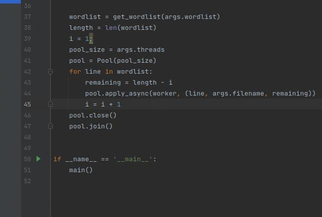

# steghidecrack

This repository provide you a python3 tool with multithreading, that allow perform a bruteforce dictionary attack over an existing image with hidden content.

```
 python3 steghidecrack.py -h
usage: steghidecrack.py [-h] [--filename FILENAME] [--wordlist WORDLIST] [--threads THREADS]

optional arguments:
  -h, --help           show this help message and exit
  --filename FILENAME  File name of image
  --wordlist WORDLIST  dictionary path
  --threads THREADS    Number of threads

```


# Initial state
```
 ls -ltrh
total 88K
-rw-rw-r-- 1 f0ns1 f0ns1  19K mar  1 13:22 image.jpeg
-rw-rw-r-- 1 f0ns1 f0ns1  57K mar  1 13:32 dictionary
-rw-rw-r-- 1 f0ns1 f0ns1 1,3K mar  1 13:42 steghidecrack.py
-rw-rw-r-- 1 f0ns1 f0ns1   16 mar  1 13:46 README.md

```


# Usage 

python3 steghidecrack.py --filename image.jpeg --wordlist dictionary --threads 200

# Final state

```
ls -ltrh
total 92K
-rw-rw-r-- 1 f0ns1 f0ns1  19K mar  1 13:22 image.jpeg
-rw-rw-r-- 1 f0ns1 f0ns1  57K mar  1 13:32 dictionary
-rw-rw-r-- 1 f0ns1 f0ns1 1,3K mar  1 13:42 steghidecrack.py
-rw-rw-r-- 1 f0ns1 f0ns1   16 mar  1 13:46 README.md
-rw-rw-r-- 1 f0ns1 f0ns1   21 mar  1 13:53 hidden.txt

```

# Image content

```
cat hidden.txt 
hidden data on image

```

based on, the following tool: https://github.com/slm/steghidecracker
